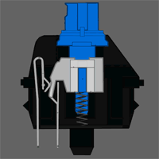

# Cherrybuckle - Cherry MX Blue mechanical keyboard simulator (compatible with Linux)


For those nostalgic for the era of tactile and auditory feedback from typing on a physical keyboard, Cherrybuckle can be utilized on Linux as a Cherry MX Blue Mechanical Keyboard Simulator.

Cherrybuckle runs as a background process and plays back the sound of each key pressed and released on your keyboard.



To temporarily silence Cherrybuckle, for example, to enter secrets, press Scroll Lock twice (but be aware that those Scroll Lock events are delivered to the application); do the same to unmute. The keycode for muting can be changed with the '-m' option. Use keycode 0 to disable the mute function.

## Links
- GitHub: https://github.com/jamescherti/cherrybuckle

## Building

#### GNU/Linux

##### Dependencies

Dependencies: libalure, libopenal, libx11, libxtst.

The dependencies can be installed on a Debian or Ubuntu system using the following commands:
```
$ sudo apt-get install build-essential git
$ sudo apt-get install libalure-dev libx11-dev libxtst-dev pkg-config
```

##### Building on GNU/Linux

###### Option 1: X11 (Recommended)

This is the preferred method for building it on GNU/Linux:

```
$ make
$ ./cherrybuckle
```

###### Option 2: Libinput

The default Linux build relies on X11 for capturing events. If you intend to use it on the Linux console or Wayland display server, you can configure it to read events from the raw input devices located in /dev/input. Keep in mind that this will require special permissions to access the devices. To make it use libinput, build with the following command:

```
$ make libinput=1
```

#### MacOS

You can compile it on macOS using the following commands:

```
$ brew install alure pkg-config
$ git clone https://github.com/jamescherti/cherrybuckle
$ cd cherrybuckle
$ sed -i '' 's/-Wall -Werror/-Wall/' Makefile
$ make
$ ./cherrybuckle
```

Note that you need superuser privileges to create the event tap on Mac OS X. Also give your terminal Accessibility rights: system preferences -> security -> privacy -> accessibility.

If you want to use Cherrybuckle while doing normal work, add an & behind the command.
```
$ sudo ./cherrybuckle &
```

#### Windows

The Windows version of Cherrybuckle is currently broken. It appears that switching from FreeLut to Alure caused the issue. There seems to be an issue with 'alureCreateBufferFromFile()' being called from another thread in the key capture callback. Assistance would be greatly appreciated.

Usage
-----

````
usage: ./cherrybuckle [options]

options:

  -b, --bucklespring        use Bucklespring sounds instead
  -d, --device=DEVICE       use OpenAL audio device DEVICE
  -f, --fallback-sound      use a fallback sound for unknown keys
  -g, --gain=GAIN           set playback gain [0..100]
  -m, --mute-keycode=CODE   use CODE as mute key (default 0x46 for scroll lock)
  -M, --mute                start the program muted
  -c, --no-click            don't play a sound on mouse click
  -k, --no-keyboard         don't play a sound on keyboard press
  -h, --help                show help
  -l, --list-devices        list available OpenAL audio devices
  -p, --audio-path=PATH     load .wav files from directory PATH
  -s, --stereo-width=WIDTH  set stereo width [0..100]
  -v, --verbose             increase verbosity / debugging
````

OpenAL notes
------------

Cherrybuckle uses the OpenAL library for mixing samples and providing a realistic 3D audio playback. This section contains some tips and tricks for properly tuning OpenAL for Cherrybuckle.

The default OpenAL settings can cause a slight delay in playback. Edit or create the OpenAL configuration file `~/.alsoftrc` and add the following options:
 ````
 period_size = 32
 periods = 4
 ````

If you are using headphones, enabling the head-related-transfer functions in OpenAL for a better 3D sound:
 ````
 hrtf = true
 ````

When starting an OpenAL application, the internal sound card is selected for output, and you might not be able to change the device using pavucontrol. The option to select an alternate device is present, but choosing the device has no effect. To solve this, add the following option to the OpenAL configuration file:
 ````
 allow-moves = true
 ````

Authors
------------
- Ico Doornekamp (Original author)
- nofal (Cherry MX sounds)
- [James Cherti](https://www.jamescherti.com/) (The maintainer of [cherrybuckle](https://github.com/jamescherti/cherrybuckle), which includes the version maintained by Ico Doornekamp and the pull request by nofal)
- Egor
- Ico Doornekamp
- Jakub Wilk
- Peter Hofmann
- Marco Trevisan
- Marco Trevisan
- Member1221
- mirabilos
- Alex Bertram
- Alexander Willner
- Anjan Momi
- Anton Karmanov
- Clipsey
- Dominik George
- Emanuel Haupt
- Jan Chren (rindeal)
- Jan Chren
- Jeroen Knoops
- Jeroen Knoops
- Nisker
- Peter Tonoli
- Sebastian Morr
- Stephen Gelman
- Vladislav Khvostov
- jeromenerf
- qu1gl3s
- rabin-io
- somini
- tensorknower69
- tnagorra
